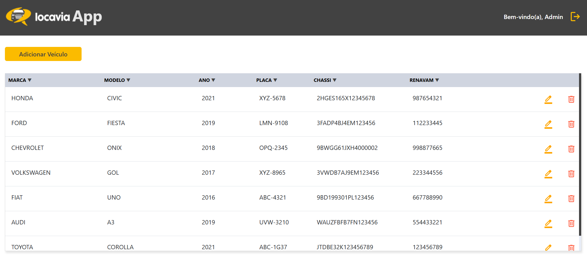

# Info-App Front-End

O **Info-App Front-End** é uma aplicação desenvolvida para o sistema **Info-App**, com a funcionalidade de gerenciar veículos. Através dessa aplicação, é possível:

- Adicionar novos veículos.
- Visualizar a lista de veículos cadastrados.
- Editar ou remover veículos existentes.

## Acesso ao Sistema

- **Login**: Admin
- **Senha**: 123

## Como Rodar o Sistema

Para executar a aplicação, utilize o seguinte comando no terminal:

```bash
ng serve

Bibliotecas instaladas
 npm install ngx-mask --save -> Para utilização de mascaras em inputs de formulários.

Imagens demonstrativas
Tela de Login


Tela Home

